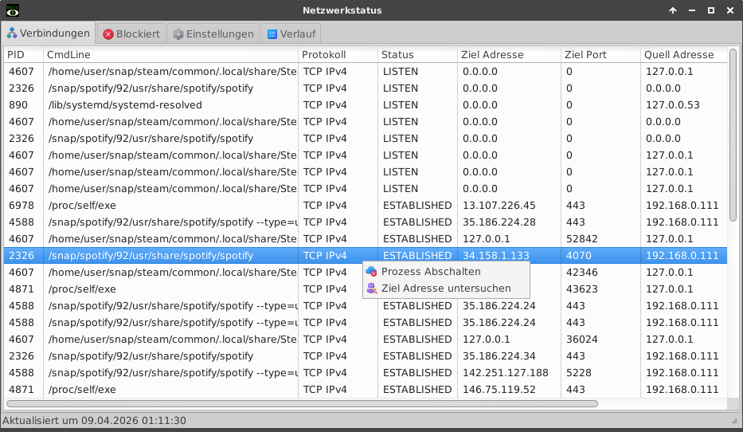

# Netzstatus
Network Connection Viewer for Linux Systems ( Ubuntu, OpenSuSe, Debian, ... )

 Netzstatus 
Ein OpenSource Monitor für Netzwerkverbindungen zur Verwendung in Linux-Artigen Betriebssystemen

Kommandozeilen Optionen:
 --help    Zeigt die Hilfe und Information im Terminal an.
 --print   Zeigt die Netzwerkverbindungen mit allen Informationen an.

Github Projekt: https://github.com/LTinnes/Netzstatus

